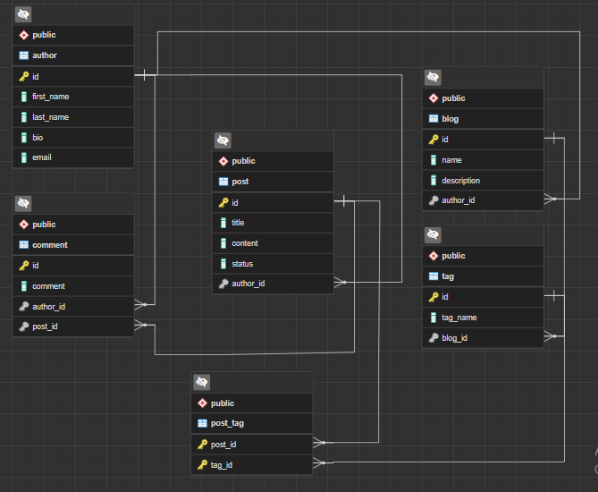
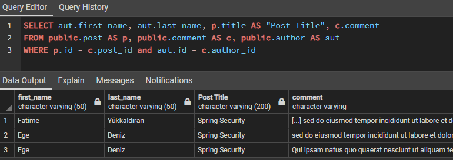
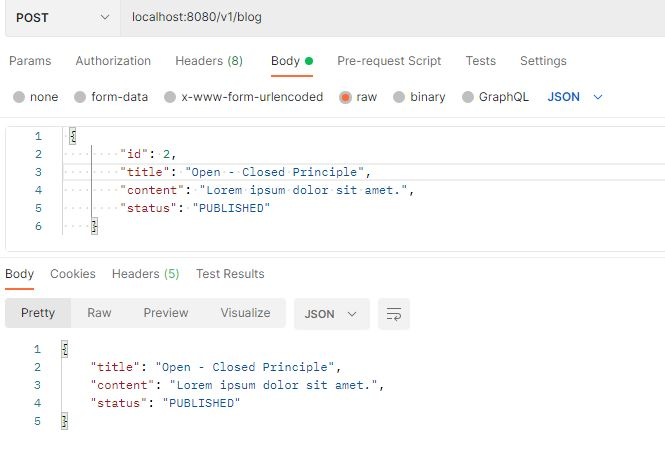
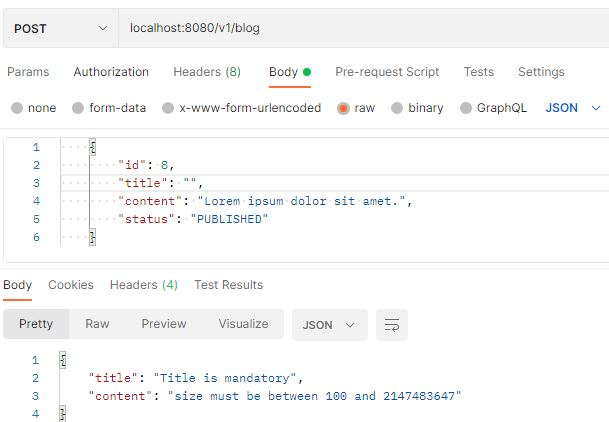

  :pushpin:  
  
 # 
 
 # FolksDev & Kod Gemisi Spring Bootcamp
 
This repo has my Spring Boot project which will develop during bootcamp.

## Blog Project

This project provides to create their blogs by users.
### Summary
Users be able to create, update and delete their blogs. Also, they can add their social media accounts and blogs can be commented on.

---
### [Task 4]( https://github.com/Folksdev-camp/folksdev-fatimeyukkaldiran/commit/c585bebc0a862ca61156538e89001b10758c06bf)
:sparkles: Create your project's entities and set up relationships in-between.

  
Model

  <ul style="font-size:105%">
    <li>
      <a href="https://github.com/Folksdev-camp/folksdev-fatimeyukkaldiran/tree/master/BlogApp/src/main/java/com/folksdev/fatimeyuk/blogapp/model/Author.kt">Author</a>
    </li>
    <li>
     <a href="https://github.com/Folksdev-camp/folksdev-fatimeyukkaldiran/tree/master/BlogApp/src/main/java/com/folksdev/fatimeyuk/blogapp/model/Post.kt">Post</a>
    </li>
    <li>
      <a href="https://github.com/Folksdev-camp/folksdev-fatimeyukkaldiran/tree/master/BlogApp/src/main/java/com/folksdev/fatimeyuk/blogapp/model/Comment.kt">Comment</a>
    </li>
    <li>
      <a href="https://github.com/Folksdev-camp/folksdev-fatimeyukkaldiran/tree/master/BlogApp/src/main/java/com/folksdev/fatimeyuk/blogapp/model/Tag.kt">Tag</a>
    </li>

  </ul>

### [Task 3](https://github.com/Folksdev-camp/folksdev-fatimeyukkaldiran/commit/e39ccafad6e067f3b406d65f733fc149881c61e2)

:sparkles: Create data base for blog project. Write a query where you can pull the blog and comments. 
:sparkles: The query code you wrote add it as SQL file to the `resource` part in the project.  

 
 BLOG ERD 

  
 
  
  

   

 
 SQL QUERIES 

 Sql query that pull blog's author, post, comment information.
 

 

  
---
 ###  [Task 2](https://github.com/Folksdev-camp/folksdev-fatimeyukkaldiran/commit/6b1dbce3ced1cb6553b1b61a0277992fcd4da183) 

 ✨ Create dummy CRUD api(BlogController) and prepare validations.

>  `Post method's sample for creating a new post on Postman` 

 
 CREATE POST 

 
 

> `Validation rules for fields`

 
 VALIDATE POST

 
 

 
---
### Task 1
 ✨Create project and load GitHub.
 
---

### Tech Stack
---
- Java 11
- Spring Boot
- Spring Data JPA
- Kotlin 1.5.0
- Restful API
- PostgreSQL
- Docker
- Docker compose
- Swagger UI documentation
- JUnit 5

Prerequisites

---
- Maven
